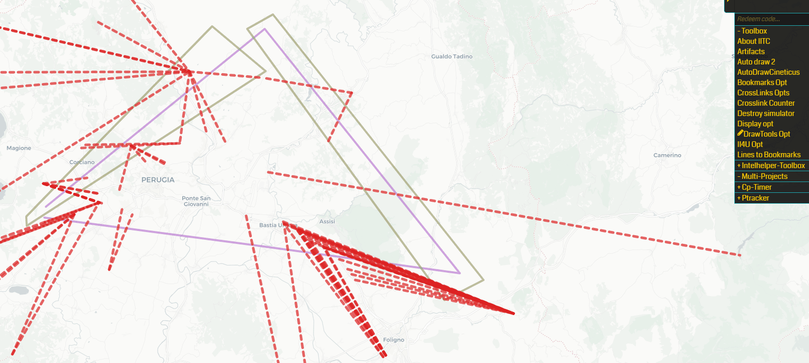

# Crosslinks Enhancements

Adds options to limit cross links detection by drawn items color and to cross links inside a polygon

This is a plugin for [Ingress Intel Total Conversion (IITC)](https://github.com/iitc-project/ingress-intel-total-conversion/).

## Overview

This plugin allows to:
- choose drawn items colors to be included or excluded from cross links detection;
- choose a polygon to limit cross links detection to links contained or intersecting it

## Installation
[Click here](https://github.com/manierim/crosslinks-enhancements/raw/master/crosslinks-enhancements.user.js) and your userscript manager should do it.

## Requirements

- [cross links](https://iitc.me/desktop/): Checks for existing links that cross planned links. Requires draw-tools plugin
- [draw tools](https://iitc.me/desktop/): Allow drawing things onto the current map so you may plan your next move

## Usage

Use the toolbox link "Cross Links Opts" to access the options dialogs.

All colors used by "crossable" drawn items are visually listed. Select one or more colors.

Then select if you want drawn items of the selected color(s) to be ignored from detection or if instead you want only drawn item of the selected color(s) to have cross links detected for.

The drawn polygon select box will list all polygons available in the draw, each with its hex color code and number of vertexes.

Each time you select an item from the list the corresponding polygon in the map will be highlighted on the map.

Press OK to apply your selections.

**The selections are saved in the browser local storage so they will persist across reload and sessions.**
Please note that settings are not currently saved "per draw/project". If you change your draw, your settings will need to be reviewed.

## Compatibility

The plugin has been tested with the following versions (current at the time of writing) **on IITC desktop**:
- cross links version 1.1.2.20181031.195523
- draw tools version 0.7.0.20181031.195523
- Destroyed Links Simulator version 0.0.7.20180217.123738

Modifications of above plugins might work as long as they do not change the original behavior too much.

## Credits

Point in Polygon function by [hayeswise/Leaflet.PointInPolygon](https://github.com/hayeswise/Leaflet.PointInPolygon)

## Changelog

- 2019-06-11 (version 1.0)
  + Initial Release
